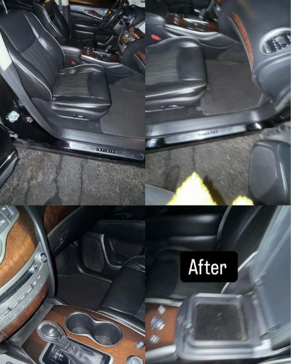

# Baily Auto Studio — Website

Single-page website for **Baily Precision Auto LLC** (DBA Baily's Turbowash 2 / Baily Auto Studio).

## Deploy to GitHub Pages

### 1. Create a GitHub repo

```bash
git init
git add .
git commit -m "Initial site"
gh repo create baily-auto --public --source=. --remote=origin --push
```

Or manually: create a new repo at github.com, then:

```bash
git remote add origin https://github.com/YOUR_USERNAME/baily-auto.git
git branch -M main
git push -u origin main
```

### 2. Enable GitHub Pages

1. Go to your repo → **Settings** → **Pages**
2. Under **Branch**, select `main` and `/ (root)`, click **Save**
3. Site will be live at `https://YOUR_USERNAME.github.io/baily-auto/` within ~60 seconds

---

## Custom Domain via GoDaddy

If you have a domain (e.g. `bailyautostudio.com`) registered at GoDaddy:

### Step A — Add CNAME file to repo

Create a file called `CNAME` (no extension) in the root of this repo containing only your domain:

```
bailyautostudio.com
```

Commit and push it.

### Step B — GoDaddy DNS Settings

Log in to GoDaddy → **My Products** → your domain → **DNS**.

Delete any existing A records pointing to `@`, then add:

| Type | Name | Value | TTL |
|------|------|-------|-----|
| A    | @    | 185.199.108.153 | 600 |
| A    | @    | 185.199.109.153 | 600 |
| A    | @    | 185.199.110.153 | 600 |
| A    | @    | 185.199.111.153 | 600 |
| CNAME | www | YOUR_USERNAME.github.io | 600 |

### Step C — Set custom domain in GitHub Pages

Repo → **Settings** → **Pages** → **Custom domain** → type `bailyautostudio.com` → Save.

Check **Enforce HTTPS** once the cert is issued (usually within 10–30 min).

---

## What needs to be swapped out (all marked `<!-- PLACEHOLDER -->`)

| Section | What to add |
|---------|-------------|
| Hero OG image | `og-image.jpg` — 1200×630px branded photo |
| About photo | Real shop/team photo (800×1000px) |
| Gallery (9 slots) | Download posts from @bailyautostudio Instagram |
| 3 Reviews | Real Google/Facebook/Instagram reviews with names |
| About copy | Owner's own words / origin story |
| Formspree ID | Go to formspree.io → create form → replace `XXXXXXXX` in `action=""` |
| Stats numbers | Update "6+ Services / 2 Brands / 614 Columbus" if needed |

## Formspree Setup (free contact form, no backend)

1. Go to [formspree.io](https://formspree.io) and create a free account
2. Click **New Form**, give it a name
3. Copy the Form ID (looks like `xpzgdqkb`)
4. In `index.html`, find `https://formspree.io/f/XXXXXXXX` and replace `XXXXXXXX` with your ID
5. Formspree free tier: 50 submissions/month — upgrade if needed

## Adding Gallery Photos from Instagram

1. Go to @bailyautostudio on Instagram
2. Download posts (screenshot or use a tool like [Instaloader](https://instaloader.github.io/))
3. Resize to ~600×600px squares
4. Save to `images/` folder in this directory
5. Replace each `<div class="g-ph">...</div>` block with:
   ```html
   
   ```
